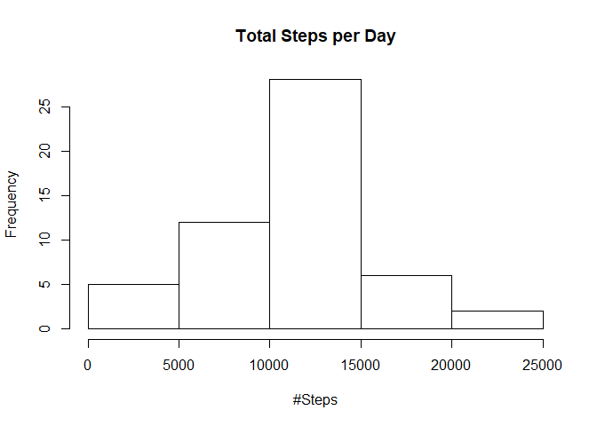
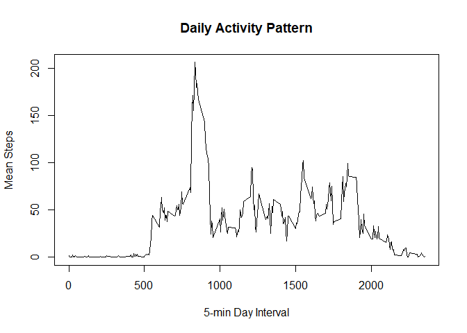
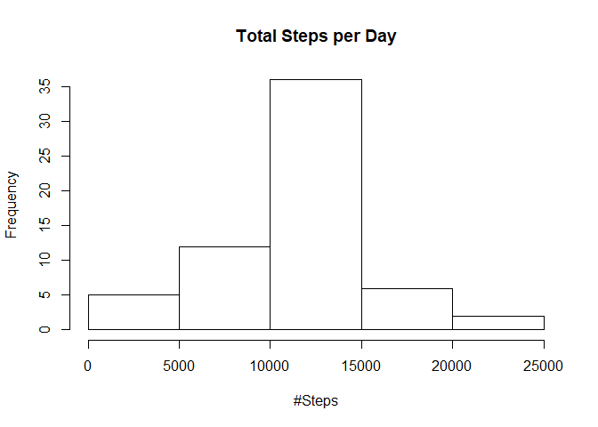
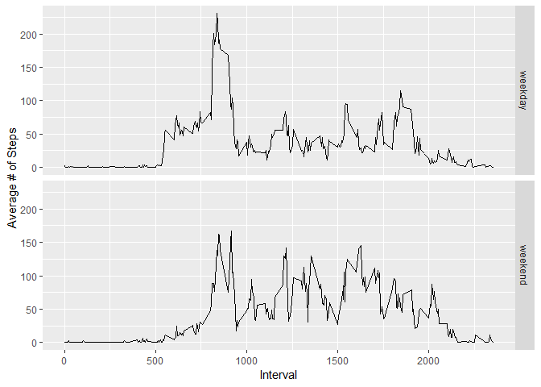

## Loading and preprocessing the data

Raw data is downloaded from Internet repository and loaded onto activityData data set. 
The data frame has three variables: steps, date and interval. "date" variable is converted to an actual date format/class.


```r
fileUrl = "https://d396qusza40orc.cloudfront.net/repdata%2Fdata%2Factivity.zip"
if (!file.exists('activity.zip')){
  download.file(fileUrl,"activity.zip", mode = "wb")
  unzip("activity.zip", exdir = getwd())
}
activityData <- read.csv("activity.csv", stringsAsFactors = FALSE)
str(activityData)
```

```
## 'data.frame':	17568 obs. of  3 variables:
##  $ steps   : int  NA NA NA NA NA NA NA NA NA NA ...
##  $ date    : chr  "2012-10-01" "2012-10-01" "2012-10-01" "2012-10-01" ...
##  $ interval: int  0 5 10 15 20 25 30 35 40 45 ...
```

```r
activityData$date <- as.Date(activityData$date)
str(activityData)
```

```
## 'data.frame':	17568 obs. of  3 variables:
##  $ steps   : int  NA NA NA NA NA NA NA NA NA NA ...
##  $ date    : Date, format: "2012-10-01" "2012-10-01" ...
##  $ interval: int  0 5 10 15 20 25 30 35 40 45 ...
```

The data frame "activityData" is now ready.

## What is mean total number of steps taken per day?

Data is grouped by date and then the mean of the steps taken is computed. All data is stored on a data frame.  

Then a histogram of total number of steps per day is plotted.  


```r
stepsDay <- activityData %>% group_by(date) %>% summarise(totalDay=sum(steps), meanDay = mean(steps), medianDay = median(steps))
hist(stepsDay$totalDay, xlab = "#Steps",main = "Total Steps per Day")
```

<!-- -->

## What is the average daily activity pattern?

On average for all days in the data set, we compute the mean number of steps per day. Missing values are not used to compute the mean.


```r
stepsInterval <- activityData %>% group_by(interval) %>% summarise(meanSteps = mean(steps, na.rm = TRUE))
with(stepsInterval, plot(interval, meanSteps, type = "l", xlab = "5-min Day Interval", ylab = "Mean Steps", main = "Daily Activity Pattern"))
```

<!-- -->

The 5-minute interval, on average across all days, that contains the maximum number of steps is:


```r
stepsInterval[stepsInterval$meanSteps == max(stepsInterval$meanSteps), ][1]
```

```
## # A tibble: 1 x 1
##   interval
##      <int>
## 1      835
```

```r
print("Interval and Maximum Average of Steps")
```

```
## [1] "Interval and Maximum Average of Steps"
```

```r
stepsInterval[stepsInterval$meanSteps == max(stepsInterval$meanSteps), ]
```

```
## # A tibble: 1 x 2
##   interval meanSteps
##      <int>     <dbl>
## 1      835      206.
```

## Imputing missing values

1. Total number of missing values on "steps" variable

```r
sum(is.na(activityData$steps))
```

```
## [1] 2304
```

```r
summary(activityData$steps)
```

```
##    Min. 1st Qu.  Median    Mean 3rd Qu.    Max.    NA's 
##    0.00    0.00    0.00   37.38   12.00  806.00    2304
```

2. Imputing strategy: missing values will be filled in with the mean value for the corresponding interval.

3. Impute data on a new data set

```r
newActivity <- activityData
newActivity[is.na(newActivity$steps), ]$steps <- 
ave(newActivity$steps, newActivity$interval, FUN = function(x)mean(x, na.rm = TRUE))[is.na(newActivity$steps)]  
```

4. Histogram of total number of steps taken each day


```r
newSD <- newActivity %>% group_by(date) %>% summarise(totalDay=sum(steps), meanDay = mean(steps), medianDay = median(steps))
hist(newSD$totalDay, xlab = "#Steps",main = "Total Steps per Day")
```

<!-- -->

```r
setdiff(newSD, stepsDay)
```

```
## # A tibble: 8 x 4
##   date       totalDay meanDay medianDay
##   <date>        <dbl>   <dbl>     <dbl>
## 1 2012-10-01   10766.    37.4      34.1
## 2 2012-10-08   10766.    37.4      34.1
## 3 2012-11-01   10766.    37.4      34.1
## 4 2012-11-04   10766.    37.4      34.1
## 5 2012-11-09   10766.    37.4      34.1
## 6 2012-11-10   10766.    37.4      34.1
## 7 2012-11-14   10766.    37.4      34.1
## 8 2012-11-30   10766.    37.4      34.1
```

The histogram shows the same distribution of data though the area of the bucket containing mean value has increased in frequency.

Comparing aggregated data by date with and without missing values, we noticed that without missing values we have records for days where no observation existed before. However mean values for days with observations have not changed.

## Are there differences in activity patterns between weekdays and weekends?

1. Create a new factor variable to report if the day is a weekend day or not.


```r
myWeek <- function(x) {
    ifelse(weekdays(x) %in% c('sábado', 'domingo'),
           "weekend", 
           "weekday")
}
newActivity$dayWeek <- sapply(newActivity$date, myWeek)
newActivity$dayWeek <- as.factor(newActivity$dayWeek)
```

2. Panel plot for mean steps per day, with break-down on "week day" and "weekend day".


```r
si <- newActivity %>% group_by(interval, dayWeek) %>% summarise(mymean = mean(steps))
qplot(interval, mymean, data = si, geom = 'line', facets = dayWeek ~ ., xlab = "Interval", ylab = "Average # of Steps")
```

<!-- -->

During week days, people walk more during the morning (until 10.00am), while during the weekend people walk less in the morning and a bit more throughout the day (until 17.30).
